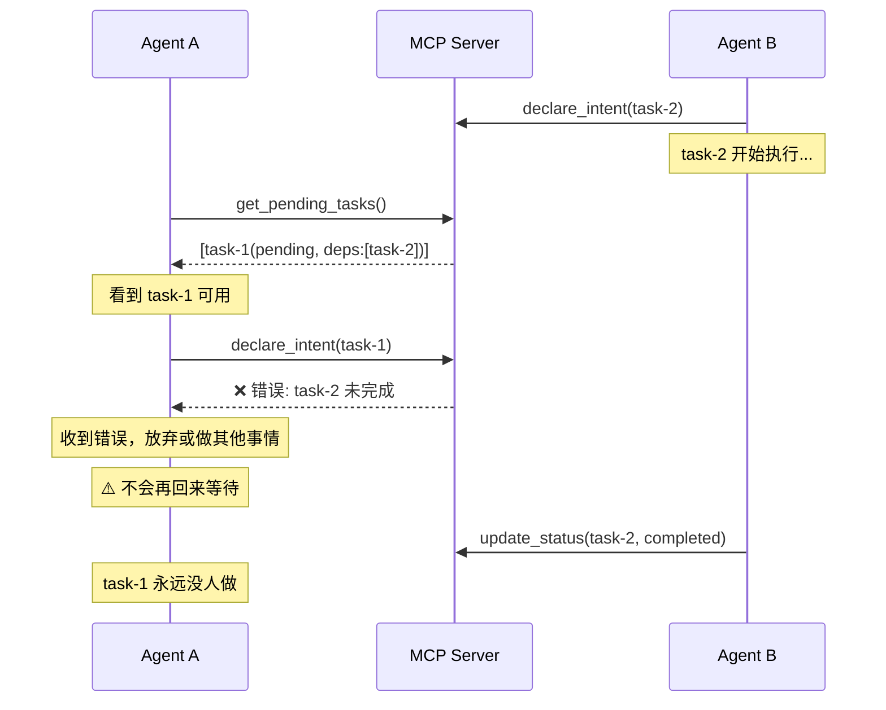
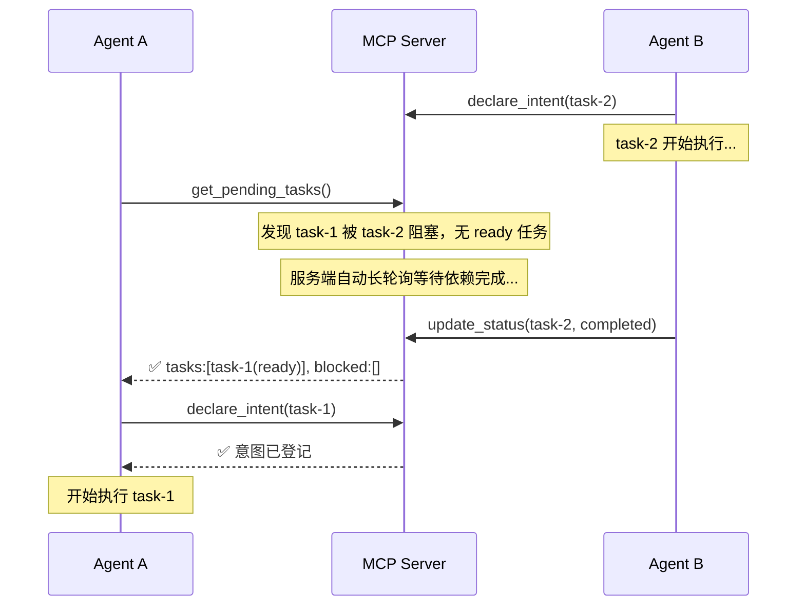

# 多 Agent 协作等待机制 — 问题分析与实施计划

## 一、问题定位

### 核心症状
> 当多个 Agent 完成一个大项目时，Agent A 并不会等待 Agent B 的任务完成，即使 Agent B 的任务是 Agent A 的前置依赖。

### 根因分析

经过对 `mcp.service.ts`、`node.service.ts`、`mcp-session.service.ts` 和 `mcp.contain.ts` 的全面审查，发现 **4 个关键缺陷**：

| # | 问题 | 位置 | 影响 |
|---|------|------|------|
| 1 | `get_pending_tasks` 返回所有 pending 任务，**不区分依赖是否已满足** | `mcp.service.ts:653-722` | Agent 看到被依赖阻塞的任务也认为可以执行 |
| 2 | `declare_intent` 虽然检查了依赖，但**失败后只返回错误**，没有引导 Agent 等待重试 | `mcp.service.ts:724-822` | Agent 收到错误后可能放弃或去做其他无关的事 |
| 3 | 短轮询仅在 **"零个 pending 任务" 时生效**（15 秒），但当有 pending 但全被阻塞时直接返回 | `mcp.service.ts:671-686` | Agent 拿到被阻塞的任务列表，尝试 declare 失败，没有等待机制 |
| 4 | **没有 "等待依赖完成" 的专用工具/动作**，Agent 只能重复调用 `get_pending_tasks` 手动轮询 | 整个 `task_tool` | 消耗大量 token，且 AI Agent 通常不会自觉循环调用 |

### 当前流程时序图（有问题的）



---

## 二、解决方案设计

### 设计原则
1. **Server-side 长轮询** — 让等待逻辑在服务端完成，减少 Agent token 消耗
2. **依赖感知分类** — 将任务明确分为 `ready`（可执行）和 `blocked`（等待依赖）
3. **新增 `wait_for_dependencies` 动作** — 提供专用的阻塞等待机制
4. **增强引导提示** — 在每个返回中给 Agent 清晰的下一步指令

### 修复后的流程时序图



---

## 三、实施计划

### 阶段 1：增强 `get_pending_tasks` — 依赖感知 + 服务端长轮询

**改动文件**: `src/mcp/mcp.service.ts`

**核心思路**:
> 将 `wait_for_dependencies` 的等待逻辑直接融入 `get_pending_tasks`，Agent 只需调用同一个工具，服务端自动判断是否需要等待。

**改动内容**:
1. 将 pending/review_needed 任务分为两类：
   - `ready`: 无依赖或所有依赖已 completed —— 可以被 Agent 立即执行
   - `blocked`: 存在未完成的依赖 —— 需要等待
2. **从原来的短轮询（15 秒等 pending 出现）扩展为两级轮询**：
   - 第一级：等待 pending 任务出现（维持原有 15 秒逻辑）
   - 第二级：有 pending 任务但全被依赖阻塞时，长轮询等待依赖完成（最长 120 秒）
3. 返回结构中增加 `blockedTasks` 字段，包含阻塞原因详情

**新常量**:
```typescript
const DEP_WAIT_MAX_MS  = 120_000;  // 依赖等待最长 2 分钟
const DEP_WAIT_POLL_MS = 3_000;    // 每 3 秒检查一次
```

**关键逻辑（伪代码）**:
```typescript
// 第一级轮询（已有）：等待 pending 任务出现
while (tasks.length === 0 && waitedMs < PENDING_TASK_WAIT_MS) { ... }

// 对所有 pending 任务进行依赖分类
const { ready, blocked } = await classifyTasksByDependency(tasks);

// 第二级轮询（新增）：当 ready 为空但 blocked 不为空时，等待依赖完成
while (ready.length === 0 && blocked.length > 0 && depWaitedMs < DEP_WAIT_MAX_MS) {
  await sleep(DEP_WAIT_POLL_MS);
  // 重新检查依赖状态
  const refreshed = await classifyTasksByDependency(refetchedTasks);
  if (refreshed.ready.length > 0) break;
}
```

### 阶段 2：增强 `declare_intent` 失败引导 + 更新提示词

**改动文件**: `src/mcp/mcp.service.ts`, `src/mcp/mcp.contain.ts`

**改动内容**:

1. **`declare_intent` 依赖失败时**：返回结构化的阻塞信息和明确的下一步引导
```typescript
// 不再仅抛出 Error，而是返回结构化阻塞信息
return ok({
  blocked: true,
  taskId: params.taskId,
  blockingDependencies: blockedDependencies,
  message: '存在未完成依赖，请调用 wait_for_dependencies 等待',
}, {
  usage: 'declare_intent 在依赖未满足时返回阻塞信息',
  nextStep: '调用 task_tool，action=wait_for_dependencies，传入 taskNodeId 等待依赖完成后再重试 declare_intent',
});
```

2. **更新 `mcp.contain.ts` 中的提示词**：
   - 在 `aiIdeTaskProtocolPrompt` 中增加依赖等待的标准流程说明
   - 在 `multiAgentProtocolPrompt` 中增加 Rule 5 — 自律等待规则
   - 在 `toolPrompt` 的 Step 4 中补充等待逻辑

---

## 四、文件改动清单

| 文件 | 改动类型 | 说明 |
|------|---------|------|
| `src/mcp/mcp.service.ts` | 修改 | 核心逻辑：依赖分类、`wait_for_dependencies`、`declare_intent` 改良 |
| `src/mcp/mcp.contain.ts` | 修改 | 提示词增加依赖等待协议说明 |

> [!NOTE]
> 不需要修改数据库结构、不需要新增实体、不需要改动 node.service.ts。所有改动集中在 MCP 工具层。

---

## 五、详细实施步骤

### Step 1: 新增常量
- 新增 `DEP_WAIT_MAX_MS`、`DEP_WAIT_POLL_MS` 常量

### Step 2: 实现依赖检查辅助方法
- 在 `McpService` 中新增 `classifyTasksByDependency()` 私有方法
- 接受节点列表，返回 `{ ready, blocked }` 分类结果

### Step 3: 改造 `get_pending_tasks`
- 调用 `classifyTasksByDependency()` 对任务分类
- 当 `ready` 为空且 `blocked` 不为空时，启动第二级长轮询
- 修改返回结构增加 `blockedTasks` 字段

### Step 4: 改造 `declare_intent` 失败路径
- 依赖未满足时返回结构化 `blocked` 响应（非 Error）
- 包含明确的 `nextStep` 引导调用 `get_pending_tasks` 重新等待

### Step 5: 更新提示词
- 更新 `multiAgentProtocolPrompt` 增加等待规则
- 更新 `aiIdeTaskProtocolPrompt` 增加依赖等待流程

### Step 6: TypeScript 编译验证

---

## 六、风险与注意事项

> [!WARNING]
> 长轮询可能占用服务端连接资源。`DEP_WAIT_MAX_MS` 限制为 2 分钟，配合 `DEP_WAIT_POLL_MS` 每 3 秒一次检查，单次最多 ~40 次数据库查询，可接受。

> [!IMPORTANT]
> 改动不会破坏现有 API 契约。`get_pending_tasks` 返回结构中新增的 `blockedTasks` 字段是可选追加字段，现有调用方不受影响。`declare_intent` 的改动将依赖阻塞从 Error 改为正常返回（带 `blocked: true`），需确保 Agent 提示词能识别新格式。

> [!TIP]
> 方案简化：不引入新工具 `wait_for_dependencies`，等待逻辑全部融入 `get_pending_tasks` 的服务端长轮询中。Agent 的调用链保持不变，服务端自动透明地处理依赖等待。
